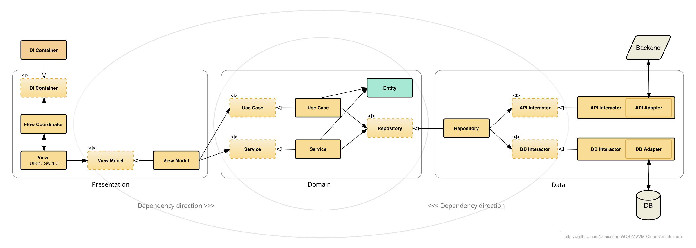

## Architecture Overview

* **DI Container**: where the instantiating of objects, managing their dependencies, and module assembly configuration takes place. Enables loose coupling and testability. Only those dependencies that are necessary for a specific module/component are initialized and injected into it, which in particular improves app performance and memory usage.

* **Flow Coordinator**: manages navigation and flow logic between modules, decoupling the components.

* **Presentation (MVVM) layer**: includes Coordinators, UI elements, SwiftUI views, UIKit storyboards, ViewControllers, ViewModels. The presence of protocols on View Models allows to implement View using both UIKit and/or SwiftUI + [ViewModelBridgeWrapper](https://github.com/denissimon/iOS-MVVM-Clean-Architecture/blob/swift6/ImageSearch/Presentation/ImagesFeature/HotTags/View/SwiftUI/HotTagsViewModelBridgeWrapper.swift).

* **Data layer**: includes Entity Repositories, APIs (like [FlickrAPI](https://github.com/denissimon/iOS-MVVM-Clean-Architecture/blob/swift6/ImageSearch/Data/APIs/FlickrAPI.swift)), API/DB Interactors, Adapters.

* **API Interactor**: remote data source - a network service (in this app there is one common) that provides an interface for interacting with the backend. Communicates directly with the API Adapter.

* **DB Interactor**: local data source - a persistent storage (in this app there can be several, grouped by entities), which is a single source of truth for data on the device. Communicates directly with the DB Adapter.

* **Repository**: mediator between API and DB Interactors. Repositories can be grouped in different ways, in this app they are grouped by entities. Theoretically, any data processing can be done here, such as merging data from different data sources, synchronization for offline access (offline-first approach), etc. This is where the use of the SOLID dependency inversion principle (DIP) is most clearly expressed, where the interface to a Repository belongs to the Domain layer, and its implementation is carried out in the Data layer.

* **Domain layer**: includes Entities, Use Cases (also known as Interactors), Services, Interfaces. It encapsulates the essential business rules and entities of the app, defines what the app does in terms of its core functionality, independent of how that functionality is presented or how data is stored. It's the most independent layer, having no direct dependencies on the UI (Presentation layer) or the data sources (Data layer), and with no imported frameworks except the Apple's core Foundation framework. This independence ensures that changes in UI frameworks or data storage mechanisms don't directly impact the core business logic.

The diagram also contains circles: the inner one is the _Domain_, then comes the _Application_ or _Application Core_, and the outermost and most unstable one is the _UI and Infrastructure_ (including tools/frameworks/libraries). Here, we stick to the main rule of Clean Architecture - the **Dependency Rule** - which says that dependencies point inward. It also follows from this that "the name of something declared in the outer circle must not be mentioned by code in the inner circle". Therefore, in particular, we convert error types from API/DB Adapters - `NetworkError` and `SQLiteError` - into the `CustomError` enum, which is then used in inner circles.

There are also technical layers Common and Resources (not shown in the diagram), to which any of the main 3 layers can have dependencies. Additionally, as the app evolves, an Application Services layer can be added to the Application circle, containing app-wide services such as Authentication, Encryption, In-App Purchases or AI/ML.

In general, this architecture is highly modular, has a clear separation of concerns, and is easy to maintain, scale, test and debug. It can be easily modularized with [Swift Package Manager](https://docs.swift.org/swiftpm/documentation/packagemanagerdocs).

It allows to swap or modify the implementation of any component without making changes to the rest of the app code. For example, for the `ImageDBInteractor` protocol, in addition to the existing `SQLiteImageDBInteractor` class that uses SQLite, we can add a `SwiftDataImageDBInteractor` class that will use SwiftData. There will be no changes to the `ImageDBInteractor` protocol, nor to repositories or other layers (Domain, Presentation). Or if some 3rd-party library changes its API, all that's needed is to modify its adapter, nothing on the left of the diagram will change.

Thanks to these system properties - both comprehensive test coverage and compartmentalization to isolate changes - further changes can be made with confidence and minimized risk of regression.

Adherence to SOLID principles within each layer contributes to self-documenting code, making it easier to understand, reducing the need for extensive documentation.
