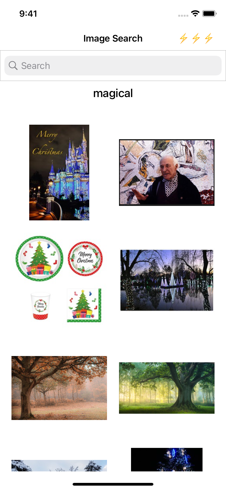
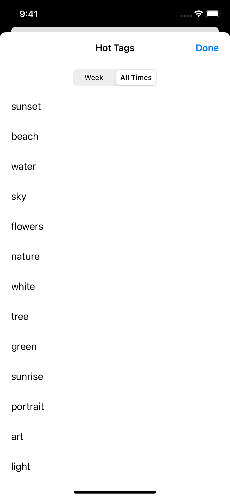

# iOS-MVVM-Clean-Architecture
[](https://swift.org)
[](https://developer.apple.com/swift/)
[](https://github.com/denissimon/iOS-MVVM-Clean-Architecture/blob/master/LICENSE)

Example iOS app designed using MVVM-C and Clean Architecture. Uses Swift Concurrency.

The app retrieves images for any search query or tag via the Flickr API. It has three modules: ImageSearch, ImageDetails, HotTags.

<table> 
  <tr>
    <td> </td>
    <td> </td>
    <td> </td>
  </tr>
</table>

### Architecture concepts used here

- [Clean Architecture][CleanArchitectureLink]
- [Explicit Architecture][ExplicitArchitectureLink]
- [MVVM][MVVMLink]
- [Flow coordinator][FlowCoordinatorLink] implemented with closure-based actions
- [Dependency Injection][DIContainerLink], DIContainer
- [Protocol-Oriented Programming][POPLink]
- [Data Binding][DataBindingLink] using the lightweight [Observable\<T\>][ObservableLink]
- [Closure-based delegation][ClosureBasedDelegationLink] using the lightweight [Event\<T\>][EventLink]
- [Pure functional transformations][PureFunctionalTransformationsLink]
- [Delegating entity behavior][DelegatingEntityBehaviorLink]
- [Alternative DTO approach][AlternativeDTOApproachLink]

[CleanArchitectureLink]: https://blog.cleancoder.com/uncle-bob/2012/08/13/the-clean-architecture.html
[ExplicitArchitectureLink]: https://herbertograca.com/2017/11/16/explicit-architecture-01-ddd-hexagonal-onion-clean-cqrs-how-i-put-it-all-together
[MVVMLink]: https://github.com/denissimon/iOS-MVVM-Clean-Architecture/tree/master/ImageSearch/Presentation/ImagesFeature/ImageSearch
[FlowCoordinatorLink]: https://github.com/denissimon/iOS-MVVM-Clean-Architecture/tree/master/ImageSearch/Coordinator
[DIContainerLink]: https://github.com/denissimon/iOS-MVVM-Clean-Architecture/blob/master/ImageSearch/Coordinator/DIContainer/DIContainer.swift
[POPLink]: https://www.swiftanytime.com/blog/protocol-oriented-programming-in-swift
[DataBindingLink]: https://github.com/denissimon/iOS-MVVM-Clean-Architecture/blob/master/ImageSearch/Presentation/ImagesFeature/ImageSearch/ViewModel/DefaultImageSearchViewModel.swift
[ObservableLink]: https://github.com/denissimon/iOS-MVVM-Clean-Architecture/blob/master/ImageSearch/Common/Utils/SwiftEvents.swift#L86
[ClosureBasedDelegationLink]: https://github.com/denissimon/iOS-MVVM-Clean-Architecture/blob/master/ImageSearch/Presentation/ImagesFeature/HotTags/ViewModel/DefaultHotTagsViewModel.swift
[EventLink]: https://github.com/denissimon/iOS-MVVM-Clean-Architecture/blob/master/ImageSearch/Common/Utils/SwiftEvents.swift
[PureFunctionalTransformationsLink]: https://blog.ploeh.dk/2020/03/02/impureim-sandwich
[DelegatingEntityBehaviorLink]: https://github.com/denissimon/iOS-MVVM-Clean-Architecture/blob/master/ImageSearch/Domain/Entities/Behaviors/ImageBehavior.swift
[AlternativeDTOApproachLink]: https://medium.com/geekculture/why-we-shouldnt-use-data-transfer-objects-in-swift-38dcef529a66

### Includes

- Reusable and universal [NetworkService][NetworkServiceLink] based on URLSession
- Reusable and universal [SQLite][SQLiteAdapterLink] wrapper around SQLite3
- [Image caching service][ImageCachingServiceLink]
- Advanced error handling
- Unit and integration tests for a number of components from all layers

[NetworkServiceLink]: https://github.com/denissimon/iOS-MVVM-Clean-Architecture/blob/master/ImageSearch/Data/Network/NetworkService/NetworkService.swift
[SQLiteAdapterLink]: https://github.com/denissimon/iOS-MVVM-Clean-Architecture/tree/master/ImageSearch/Data/Persistence/SQLite
[ImageCachingServiceLink]: https://github.com/denissimon/iOS-MVVM-Clean-Architecture/blob/master/ImageSearch/Domain/Services/ImageCachingService.swift

### Main layers

**Presentation (MVVM)**: _coordinators_, _UI elements_, _SwiftUI views_, _UIKit storyboards_, _ViewControllers_, _ViewModels_

**Domain**: _entities_, _use cases_, _services_, _interfaces_ (for use cases, services and repositories)

**Data**: _entity repositories_, _APIs_, _API/DB interactors_ (or network services and storages), _adapters_

### Use case scenarios

ImageSearch module:
```swift
* searchImagesUseCase.execute(imageQuery)
* imageCachingService.cacheIfNecessary(data)
* imageCachingService.getCachedImages(searchId: searchId)
```

ImageDetails module:
```swift
* getBigImageUseCase.execute(for: image)
```

HotTags module:
```swift
* getHotTagsUseCase.execute()
```

### Image caching service

[ImageCachingService][ImageCachingServiceLink] implements the logic for caching downloaded images and freeing memory. This helps keep the app's memory usage under control, since there can be a lot of downloaded images, and without caching, the app could quickly accumulate hundreds of MB of memory used. Downloaded images are cached and read from the cache automatically.

### Reusable components from this project

- [SwiftEvents](https://github.com/denissimon/SwiftEvents) - the easiest way to implement data binding and notifications. Includes Event\<T\> and Observable\<T\>. Has a thread-safe version.
- [URLSessionAdapter](https://github.com/denissimon/URLSessionAdapter) - a Codable wrapper around URLSession for networking
- [SQLiteAdapter](https://github.com/denissimon/SQLiteAdapter) - a simple wrapper around SQLite3

### Requirements

iOS version support: 15.0+. Xcode 13.0+, Swift 5.5+
